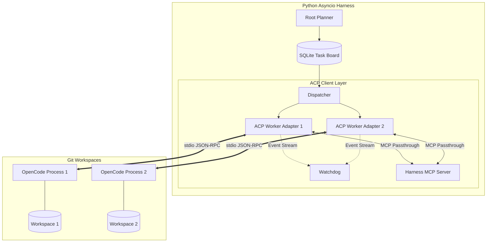

# ACP (Agent Client Protocol) Integration Architecture

This document details the architectural design for integrating the Agent Client Protocol (ACP) into the multi-agent orchestration harness. By adopting ACP, the harness transitions from using custom-built Python workers to orchestrating standardized, ACP-compliant agents (specifically OpenCode) as isolated worker processes.

## 1. High-Level Architecture

The Orchestrator acts as an **ACP Client**, managing a pool of ACP Agents (OpenCode) via JSON-RPC 2.0 over `stdio`.



## 2. Process & Lifecycle Management

The Orchestrator spawns OpenCode instances as subprocesses. Each worker gets its own isolated git workspace.

### Lifecycle Flow
1. **Spawn**: `asyncio.create_subprocess_exec("opencode", "acp", cwd=workspace_path)`
2. **Initialize**: Orchestrator connects ACP Client to the subprocess `stdin`/`stdout`.
3. **Session Creation**: Orchestrator calls `session/new` passing the workspace path and MCP configurations.
4. **Execution**: Orchestrator calls `session/prompt` with the Task description.
5. **Teardown**: On completion, Orchestrator calls `session/cancel` (if needed) and terminates the subprocess.

### Code Pattern: ACP Worker Adapter
```python
import asyncio
from acp import ACPClient, StdioTransport

class ACPWorkerAdapter:
    def __init__(self, worker_id: str, workspace_path: str, db: SQLiteDB):
        self.worker_id = worker_id
        self.workspace_path = workspace_path
        self.db = db
        self.process = None
        self.client = None
        self.session_id = None

    async def start(self):
        # 1. Spawn subprocess
        self.process = await asyncio.create_subprocess_exec(
            "opencode", "acp",
            stdin=asyncio.subprocess.PIPE,
            stdout=asyncio.subprocess.PIPE,
            cwd=self.workspace_path
        )
        
        # 2. Initialize ACP Client over stdio
        transport = StdioTransport(self.process.stdin, self.process.stdout)
        self.client = ACPClient(transport)
        await self.client.connect()

        # 3. Create or Load Session
        # Check SQLite for existing session to resume
        existing_session = await self.db.get_acp_session(self.worker_id)
        if existing_session:
            self.session_id = existing_session
            await self.client.load_session(self.session_id)
        else:
            response = await self.client.new_session(
                working_directory=self.workspace_path,
                mcp_servers=self._get_harness_mcp_config()
            )
            self.session_id = response.session_id
            await self.db.save_acp_session(self.worker_id, self.session_id)

    async def execute_task(self, task: Task) -> Handoff:
        # Start the prompt and stream updates
        stream = await self.client.prompt(
            session_id=self.session_id,
            message=task.description,
            mode="code"
        )
        
        narrative_chunks = []
        async for event in stream:
            await self._route_event(event, narrative_chunks)
            
        # Post-run: Compute diffs using existing PyO3/Rust acceleration
        diffs = await compute_diff(task.base_snapshot, self.workspace_path)
        
        return Handoff(
            task_id=task.id,
            narrative="".join(narrative_chunks),
            diffs=diffs,
            status=HandoffStatus.COMPLETED
        )
```

## 3. Mapping ACP to the Handoff Model

The existing harness expects a `Handoff` object containing a narrative, file diffs, and metrics. ACP streams granular events.

| ACP Event | Harness Mapping |
| :--- | :--- |
| `agent_message_chunk` | Appended to `Handoff.narrative`. |
| `tool_call` (fs/write, bash) | Ignored for diffs. We rely on the existing **PyO3/Rust `compute_diff`** post-run to compare the workspace state. This guarantees 100% accurate diffs regardless of how the agent modified files. |
| `tool_call` (duration, tokens) | Aggregated into `HandoffMetrics` (tool_count, execution_time). |
| `plan` | Logged to the event bus for CLI rendering, but not strictly required for the Handoff. |
| `session/prompt` completion | Triggers the creation of the final `Handoff` object and signals the Orchestrator to attempt an Optimistic 3-Way Merge. |

## 4. Watchdog Monitoring & Telemetry

The Watchdog shifts from monitoring internal Python threads to monitoring the ACP event stream.

### Detection Heuristics
1. **Zombies**: The Watchdog tracks `last_event_timestamp` for each session. If `now() - last_event_timestamp > 120s`, the Watchdog issues a `session/cancel` and restarts the subprocess.
2. **Tunnel Vision**: The Watchdog intercepts `tool_call` events. If it sees `fs/read_text_file` on the exact same path > 5 times within a single prompt session, it injects a system message via `session/prompt` (if supported) or cancels the session with a specific error budget deduction.
3. **Token Burn**: If `tool_call` count > 15 with 0 `agent_message_chunk` events (silent looping), the Watchdog terminates the session.

```python
async def _route_event(self, event, narrative_chunks):
    # Update Watchdog heartbeat
    await self.watchdog.ping(self.worker_id, event)
    
    if event.type == "agent_message_chunk":
        narrative_chunks.append(event.content)
    elif event.type == "request_permission":
        await self._handle_permission(event)
```

## 5. State Persistence & Crash Recovery (`session/load`)

ACP's `session/load` combined with the harness's SQLite database provides robust crash recovery.

1. **State Storage**: OpenCode persists its own session state (e.g., in `.opencode/sessions/`). The Orchestrator stores the `acp_session_id` in the SQLite `Task` table.
2. **Crash Scenario**: The Orchestrator process is killed (SIGKILL).
3. **Recovery Flow**:
   - Orchestrator boots, reads SQLite.
   - Finds Task `T-123` in `IN_PROGRESS` state with `acp_session_id = "sess_abc"`.
   - Orchestrator spawns OpenCode subprocess in the worker's workspace.
   - Orchestrator calls `session/load(session_id="sess_abc")`.
   - Orchestrator resumes listening to the event stream or issues a status check to determine if the agent was mid-generation.

## 6. Safety & Permission Control (HITL)

ACP's `session/request_permission` acts as the Human-In-The-Loop (HITL) gate.

### Policy Matrix
| Tool / Action | Policy | Rationale |
| :--- | :--- | :--- |
| `fs/read_text_file` | **Auto-Approve** | Safe, read-only. |
| `fs/write_text_file` | **Auto-Approve** | Safe because it occurs inside the isolated Git workspace copy. |
| `terminal/output` | **Auto-Approve** | Safe, read-only. |
| `terminal/create` (bash) | **Regex Filter** | Auto-approve safe commands (`ls`, `grep`, `pytest`). **Deny/Escalate** dangerous commands (`rm -rf /`, network exfiltration). |
| `mcp/*` | **Auto-Approve** | Controlled entirely by the Orchestrator's exposed MCP servers. |

```python
async def _handle_permission(self, event):
    if event.tool_name.startswith("fs/"):
        await self.client.grant_permission(event.request_id, "approve")
    elif event.tool_name == "terminal/create":
        if is_safe_command(event.params.get("command")):
            await self.client.grant_permission(event.request_id, "approve")
        else:
            await self.client.grant_permission(event.request_id, "deny", reason="Command violates safety policy.")
```

## 7. MCP Passthrough Strategy

To bridge the gap between the "dumb" ACP agent and the "smart" Orchestrator, the Orchestrator injects custom MCP servers into the OpenCode session via the `mcp_servers` configuration in `session/new`.

### Provided MCP Servers
1. **`mcp-harness-context`**:
   - `read_scratchpad()`: Allows the agent to read the current global plan.
   - `read_agents_md()`: Allows the agent to read project rules.
2. **`mcp-task-board`**:
   - `spawn_subtask(description)`: Allows the worker to dynamically request help, which the Orchestrator intercepts and adds to the SQLite Task Board.

*Configuration:*
```json
{
  "mcp_servers": {
    "harness_context": {
      "command": "uv",
      "args": ["run", "python", "-m", "harness.mcp.context_server"]
    }
  }
}
```

## 8. Failure Modes & Mitigations

| Failure Mode | Detection | Mitigation |
| :--- | :--- | :--- |
| **Subprocess Death** | `EOFError` on stdio transport, or `process.returncode != None`. | Orchestrator catches exception, respawns subprocess, calls `session/load`. Deducts 1 from Error Budget. |
| **JSON-RPC Corruption** | SDK parsing error / `ValueError`. | Drop malformed message. If stream breaks, restart subprocess and `session/load`. |
| **Agent Hangs** | Watchdog detects no events for `TIMEOUT` seconds. | Orchestrator sends `SIGTERM` to subprocess. Respawns and issues `session/cancel` to abort the stuck prompt, then retries. |
| **Protocol Mismatch** | `session/new` returns error regarding unsupported features. | Pre-flight check: Orchestrator runs `opencode --version` before spawning to ensure compatibility. |
| **Workspace Corruption** | `compute_diff` fails or git status is broken. | Orchestrator wipes the worker workspace, re-clones from the base snapshot, and restarts the task. |

## 9. Implementation Steps

1. **Dependency**: Add `agent-client-protocol` to `pyproject.toml`.
2. **Adapter**: Implement `ACPWorkerAdapter` in `src/harness/worker/acp_adapter.py` implementing the existing `BaseWorker` interface.
3. **Transport**: Implement the `asyncio` subprocess lifecycle management.
4. **Watchdog Integration**: Update `src/harness/watchdog.py` to accept ACP event streams instead of internal thread metrics.
5. **Diffing**: Wire the end of `session/prompt` to trigger the existing PyO3 `compute_diff` function.
6. **Testing**: Add Layer 5.7 tests specifically for ACP subprocess lifecycle (mocking the OpenCode binary with a dummy script that emits ACP JSON-RPC).
